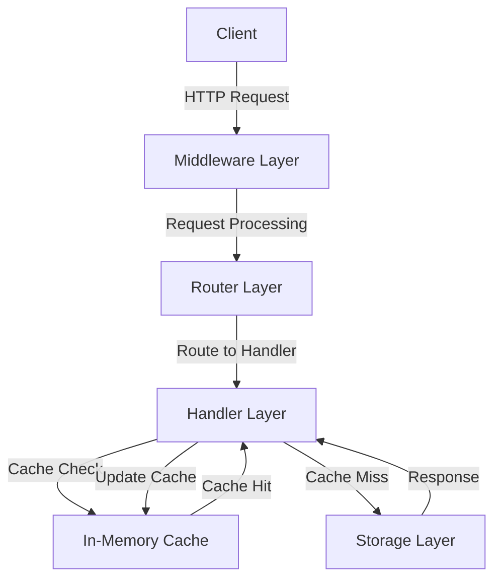
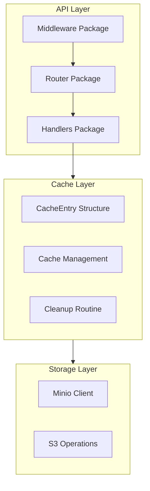

# S3 Proxy Cache Service Technical Documentation

## Overview

The S3 Proxy Cache Service is a Go-based middleware that provides a caching layer in front of S3-compatible storage services. It implements a RESTful API using the standard `net/http` package to handle object storage operations while maintaining an in-memory cache to improve read performance and reduce backend load.

## Goals

- Provide a caching layer for S3-compatible storage services
- Reduce latency for frequently accessed objects
- Minimize backend storage load
- Maintain consistency between cache and storage
- Handle concurrent requests efficiently
- Follow clean architecture principles

## Architecture

### System Architecture



### Component Architecture



## Project Structure

```
.
├── cmd/
│   └── server/
│       └── main.go
└── internal/
    ├── middleware/
    │   ├── logging.go
    │   └── middleware.go
    ├── handlers/
    │   ├── health.go
    │   └── object.go
    ├── router/
    │   └── router.go
    ├── cache/
    │   └── cache.go
    ├── config/
    │   └── config.go
    └── storage/
        └── storage.go
```

## Modules

### Router Module

- Framework: Standard `net/http`
- Components:
  - Router setup and configuration
  - Middleware chain management
  - Route registration

### Middleware Module

- Logging middleware with request/response tracking
- Middleware chaining support
- Extensible middleware architecture

### Handlers Module

- Object Handler:
  - `GET /objects/:bucket/*key`: Retrieve objects with caching
  - `PUT /objects/:bucket/*key`: Upload objects and invalidate cache
  - `DELETE /objects/:bucket/*key`: Remove objects and invalidate cache
  - `HEAD /objects/:bucket/*key`: Retrieve object metadata with caching
- Health Handler:
  - `GET /health`: Service health check

### Cache Module

- Type: In-memory cache using `sync.Map`
- Configuration:
  - Default TTL: 5 minutes
  - Maximum cache size: 100MB
  - Cleanup interval: 1 minute
- Features:
  - Thread-safe operations
  - LRU-like eviction policy
  - Automatic cleanup of expired entries
  - Size-based eviction
  - Compression support for large objects

### Storage Module

- Client: Minio SDK
- Features:
  - S3-compatible interface
  - Configurable endpoints
  - SSL support
  - Error handling for common scenarios

## Data Models

### CacheEntry Structure

```go
type CacheEntry struct {
    Data           []byte
    CompressedData []byte
    ContentType    string
    Size          int64
    LastModified  time.Time
    ETag          string
    ExpiresAt     time.Time
    IsCompressed  bool
}
```

## Infrastructure Setup

### Environment Variables

- `S3_ENDPOINT`: S3-compatible storage endpoint (default: "localhost:9000")
- `S3_ACCESS_KEY`: Access key for authentication (default: "minioadmin")
- `S3_SECRET_KEY`: Secret key for authentication (default: "minioadmin")
- `S3_USE_SSL`: Enable/disable SSL (default: "false")
- `ALLOWED_BUCKETS`: Define allowed buckets and access permissions (default: "public:read,private:all,local:all")

### Dependencies

- `minio-go`: S3 client SDK
- `log/slog`: Structured logging

## API Reference

### GET /objects/:bucket/*key

- Description: Retrieves an object from cache or storage
- Parameters:
  - bucket: Storage bucket name
  - key: Object key path
- Response:
  - 200: Success with object data
  - 404: Object not found
  - 500: Internal server error
- Headers:
  - Content-Type: Object MIME type
  - Content-Length: Object size
  - Last-Modified: Object modification time
  - ETag: Object entity tag
  - Content-Encoding: gzip (when compressed)

### PUT /objects/:bucket/*key

- Description: Uploads an object and invalidates cache
- Parameters:
  - bucket: Storage bucket name
  - key: Object key path
- Request:
  - Body: Object data
  - Content-Type: Object MIME type
  - Content-Encoding: gzip (optional)
- Response:
  - 200: Success
  - 400: Bad request
  - 500: Internal server error

### DELETE /objects/:bucket/*key

- Description: Removes an object and invalidates cache
- Parameters:
  - bucket: Storage bucket name
  - key: Object key path
- Response:
  - 204: Success
  - 404: Not found
  - 500: Internal server error

### HEAD /objects/:bucket/*key

- Description: Retrieves object metadata from cache or storage
- Parameters:
  - bucket: Storage bucket name
  - key: Object key path
- Response:
  - 200: Success with metadata headers
  - 404: Object not found
  - 500: Internal server error

## Logging and Monitoring

### Structured Logging

- Uses `log/slog` for structured JSON logging
- Log levels: INFO, ERROR
- Key metrics logged:
  - Request duration
  - Response size
  - Status code
  - Remote address
  - User agent

### Metrics to Track

- Cache hit/miss ratio
- Cache size utilization
- Request latency
- Error rates
- Backend storage operations

## Security Practices

### Authentication

- Uses static credentials for S3 authentication
- Supports SSL for secure communication

### Thread Safety

- Uses `sync.Map` for thread-safe cache operations
- Implements mutex locks for cache size management
- Handles concurrent requests safely

## Best Practices

### Clean Architecture

1. Separation of concerns with distinct packages
2. Dependency injection for better testability
3. Interface-based design
4. Middleware chain pattern

### Cache Management

1. Size-based eviction
2. Automatic cleanup routine
3. Cache consistency
4. Compression support for large objects

### Error Handling

1. Proper error propagation
2. Specific error status codes
3. Storage-specific error handling
4. Graceful degradation

### Performance Optimization

1. In-memory caching
2. Efficient memory usage
3. Concurrent operations
4. Compression support

## Recommendations for Improvement

1. Implementation Enhancements:
   - Add request validation middleware
   - Implement rate limiting
   - Add cache statistics endpoints
   - Implement request tracing

2. Security Enhancements:
   - Add authentication middleware
   - Implement bucket access controls
   - Add request signing
   - Enhance audit logging

3. Operational Enhancements:
   - Add metrics middleware
   - Implement distributed caching
   - Add cache warmup strategies
   - Include backup procedures

4. Performance Enhancements:
   - Optimize compression strategies
   - Implement partial object caching
   - Add batch operations
   - Include cache preloading

## Maintenance Tasks

- Regular cache size monitoring
- Performance profiling
- Security updates
- Dependency management