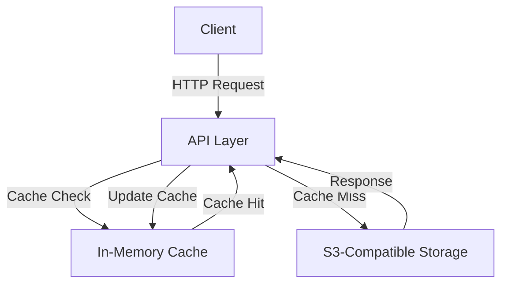
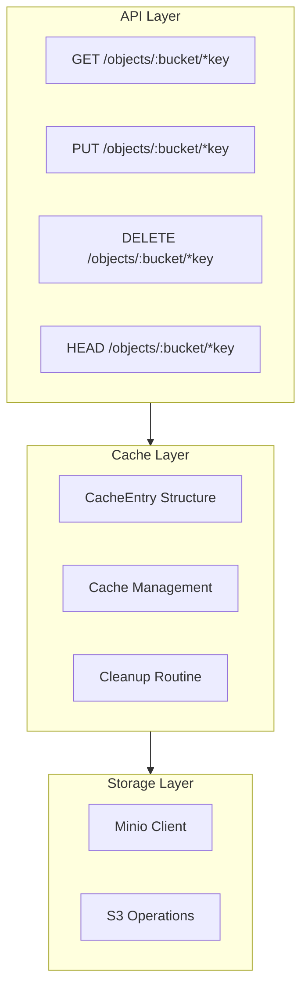

# S3 Proxy Cache Service Technical Documentation

## Overview
The S3 Proxy Cache Service is a Go-based middleware that provides a caching layer in front of S3-compatible storage services. It implements a RESTful API to handle object storage operations while maintaining an in-memory cache to improve read performance and reduce backend load.

## Goals
- Provide a caching layer for S3-compatible storage services
- Reduce latency for frequently accessed objects
- Minimize backend storage load
- Maintain consistency between cache and storage
- Handle concurrent requests efficiently

## Architecture

### System Architecture


### Component Architecture


## Modules

### API Module
- Framework: Gin Web Framework
- Endpoints:
  - `GET /objects/:bucket/*key`: Retrieve objects with caching
  - `PUT /objects/:bucket/*key`: Upload objects and invalidate cache
  - `DELETE /objects/:bucket/*key`: Remove objects and invalidate cache
  - `HEAD /objects/:bucket/*key`: Retrieve object metadata with caching

### Cache Module
- Type: In-memory cache using `sync.Map`
- Configuration:
  - Default TTL: 5 minutes
  - Maximum cache size: 100MB
  - Cleanup interval: 1 minute
- Features:
  - Thread-safe operations
  - LRU-like eviction policy
  - Automatic cleanup of expired entries
  - Size-based eviction

### Storage Module
- Client: Minio SDK
- Features:
  - S3-compatible interface
  - Configurable endpoints
  - SSL support
  - Error handling for common scenarios

## Data Models

### CacheEntry Structure
```go
type CacheEntry struct {
    Data         []byte
    ContentType  string
    Size         int64
    LastModified time.Time
    ETag         string
    ExpiresAt    time.Time
}
```

## Infrastructure Setup

### Environment Variables
- `S3_ENDPOINT`: S3-compatible storage endpoint (default: "localhost:9000")
- `S3_ACCESS_KEY`: Access key for authentication (default: "minioadmin")
- `S3_SECRET_KEY`: Secret key for authentication (default: "minioadmin")
- `S3_USE_SSL`: Enable/disable SSL (default: "false")

### Dependencies
- gin-gonic/gin: Web framework
- minio-go: S3 client SDK

## API Reference

### GET /objects/:bucket/*key
- Description: Retrieves an object from cache or storage
- Parameters:
  - bucket: Storage bucket name
  - key: Object key path
- Response:
  - 200: Success with object data
  - 404: Object not found
  - 500: Internal server error
- Headers:
  - Content-Type: Object MIME type
  - Content-Length: Object size
  - Last-Modified: Object modification time
  - ETag: Object entity tag

### PUT /objects/:bucket/*key
- Description: Uploads an object and invalidates cache
- Parameters:
  - bucket: Storage bucket name
  - key: Object key path
- Request:
  - Body: Object data
  - Content-Type: Object MIME type
- Response:
  - 200: Success
  - 500: Internal server error

### DELETE /objects/:bucket/*key
- Description: Removes an object and invalidates cache
- Parameters:
  - bucket: Storage bucket name
  - key: Object key path
- Response:
  - 204: Success
  - 500: Internal server error

### HEAD /objects/:bucket/*key
- Description: Retrieves object metadata from cache or storage
- Parameters:
  - bucket: Storage bucket name
  - key: Object key path
- Response:
  - 200: Success with metadata headers
  - 404: Object not found
  - 500: Internal server error

## Security Practices

### Authentication
- Uses static credentials for S3 authentication
- Supports SSL for secure communication

### Thread Safety
- Uses `sync.Map` for thread-safe cache operations
- Implements mutex locks for cache size management
- Handles concurrent requests safely

## Best Practices

### Cache Management
1. Implements size-based eviction to prevent memory exhaustion
2. Uses automatic cleanup routine for expired entries
3. Maintains cache consistency with backend storage
4. Implements efficient cache key structure

### Error Handling
1. Proper error propagation
2. Specific error status codes
3. Storage-specific error handling
4. Graceful degradation on cache failures

### Performance Optimization
1. In-memory caching for frequently accessed objects
2. Efficient memory usage with size limits
3. Concurrent operations support
4. Minimized lock contention

## Recommendations for Improvement

1. Implementation Enhancements:
   - Add cache warmup mechanism
   - Implement cache statistics/metrics
   - Add configurable cache policies
   - Include request rate limiting

2. Security Enhancements:
   - Add authentication/authorization layer
   - Implement bucket access controls
   - Add request signing
   - Include audit logging

3. Operational Enhancements:
   - Add health check endpoints
   - Implement monitoring/alerting
   - Add distributed caching support
   - Include backup/recovery procedures

4. Performance Enhancements:
   - Add compression support
   - Implement partial object caching
   - Add batch operations
   - Include cache preloading

## Monitoring and Maintenance

### Metrics to Track
- Cache hit/miss ratio
- Cache size utilization
- Request latency
- Error rates
- Backend storage operations

### Maintenance Tasks
- Regular cache size monitoring
- Performance optimization
- Security updates
- Dependency updates